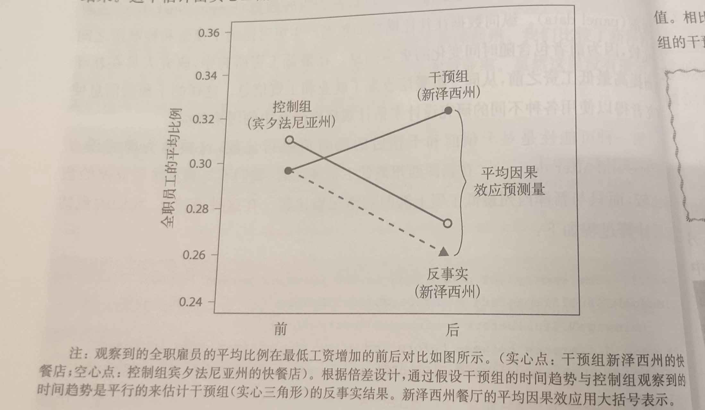
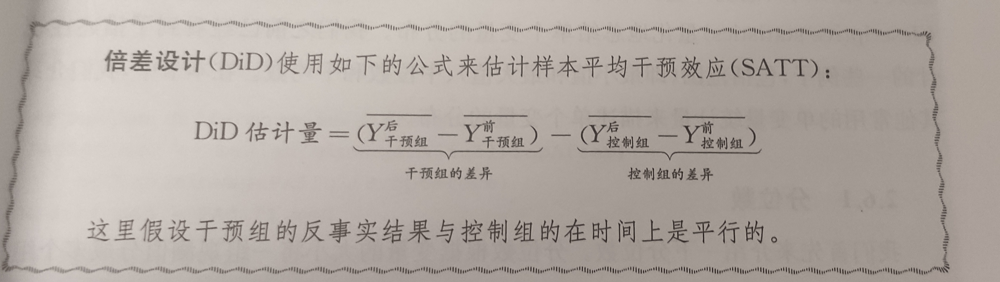

------------------------------------------------------------------------

# 2 因果关系

浅薄的人相信运气、相信环境。强者相信**诸事皆有因果**。

------《生活的准则》

## 2.1 劳动市场的种族歧视

干预变量与结果变量

干预变量是更改申请者的姓名；结果变量是申请人是否能获得电话回复。

创建列联表（交叉表）来概述工作申请者的种族与是否收到电话回复的关系。

双向的列联表包含每个类别的观察值数量，由相应的行和列定义。

ra`ce.call.tab <- table(race = resume$race, call = resume$call)`

`race.call.tab`

`addmargins(race.call.tab)`

`# addmargins 计算每行每列的总和`

\## 计算整体的电话回复率

`sum(race.call.tab[,2]/nrow(resume))`

\## 计算黑人和白人的电话回复率

`race.call.tab[1,2]/ sum(race.call.tab[1,])` #黑人

`race.call.tab[2,2]/ sum(race.call.tab[2,])` #白人

\# 一般情况下二元变量的样本平均数（01变量）就是该变量取值为1 的观察值的样本比例。

`mean(resume$call)`

## 2.2 用R取得的数据子集

### 2.2.1 逻辑值与运算符号

```{r}


# logical值
class(TRUE) # TRUE和FALSE都是逻辑值

# 转换成int数值型
as.integer(TRUE) # 结果为1
as.integer(FALSE) # 结果为0

# 当用mean()和sum()计算logical值会自动转换成数值

x <- c(TRUE,FALSE,TRUE)
# a vecotr with logical values 
class(x) # logical
mean(x) # 0.6666667
sum(x)  # 2

# 运算

# 与 and
TRUE & TRUE  # TRUE 
TRUE & FALSE # FALSE
FALSE & FALSE # FALSE

# 或 or
TRUE | TRUE # TRUE
TRUE | FALSE # TRUE
FALSE | FALSE # FALSE

# 混合

(TRUE & FALSE ) | TRUE #  TRUE


```

```{r}
# 两个逻辑值向量也可以运算
TF1 <- c(TRUE,FALSE,TRUE)
TF2 <- c(FALSE,FALSE,TRUE)

TF1 | TF2 # TRUE FALSE  TRUE

TF1 & TF2 # FALSE FALSE  TRUE
```

### 2.2.2 关系运算符

\>= == \<= !=

```{r}
# 强制转换类型
x
x.int <- (x > 0) & (x <= 2) # logical vector
x.int # TRUE FALSE  TRUE

mean(x)

sum(x)
```

### 2.2.3 生成子集

\# 取得数据子集的几种方法

\# 方法一：

`mean(resume$call[ resume$race == "black"])`

\# 方法二：

`resume$race[1:5]`

\# 方法三：

`(resume$race == "black")[1:5]`

\# 利用subset()创建新的数据框

`resuemBF <- subset(resume,select = c("call","firstname"),subset= (race == "black" & sex == "female"))`

\# 获取黑人女性的名字和被回复电话的数据

`head(resuemBF)`

\# 方括号也可以实现

`resumebf <- resume[resume$race == "black" & resume$sex == "female", c("call","firstname")]`

`head(resumebf)`

### 2.2.4 简单的条件语句

`ifelse(x,y,z)`

\# 当x正确的时候返回y，当x错误的时候返回z

`resume$BlackFemale <- ifelse(resume$race == "black"& resume$sex == "female",1,0`)

### 2.2.5 因子变量

因子变量和分类变量是一个意思，这种变量只有有限的几个不同的取值和级别。

`resume$type <- NA`

`resume$type[resume$race == "black"&resume$sex == "female"] <- "BlackFemale"`

`resume$type[resume$race == "black"&resume$sex == "male"] <- "BlackMale"`

`resume$type[resume$race == "white"&resume$sex == "female"] <- "WhiteFemale"`

`resume$type[resume$race == "white"&resume$sex == "male"] <- "WhiteMale"`

\# 观察类型

`class(resume$type) # "character"`

\# 因子变量是有级别的数值，每个数值都有字符标签

\# 转化为因子变量

`resume$type <- as.factor(resume$type)`

\# 显示因子变量的级别

`levels(resume$type)`

`# "BlackFemale" "BlackMale"   "WhiteFemale"`

`# "WhiteMale"`

`table(resume$type)`

\# tapply(x,index,function)

\# 在因子变量中重复应用函数

`tapply(resume$call,resume$type,mean)`

`resume$firstname <- as.factor(resume$firstname)`

`callback.name <- tapply(resume$call,resume$firstname,mean)`

\# 排序sort()

`sort(callback.name)`

## 2.3 因果效应与事实

因果推断的根本问题在于我们无法观察到反事实。

区分因果关系，观察每个观察值T~i~对于结果Y~i~的的因果效应。

对于每一个观察值i，我们将二元变量T~i~的因果效应定义为两个潜在结果的差Y~i~(1) - Y~i~(0)。其中，Y~i~(1)是表示受到干预后的结果(T~i~ = 1)，而Y~i~ (0)表示在控制条件下(T~i~ =0)的可能结果。

**因果推断的根本问题**是我们只观察两种潜在结果的一种，观察到哪种潜在结果取决于**干预状态**。通常观察到的结果都是Y~i~等于Yi(T~i~)。

如果是不可改变的特征，那关于这些特征的因果性问题也就无法回答。一个说法是："没有操纵就没有因果关系"。

通过规避操纵种族本身的困难来推断框架中的种族歧视。

## 2.4 随机对照实验

### 2.4.1 随机化的作用

随机对照实验使得研究人员能够分离干预变量的影响并且量化不确定性。

样本平均干预效果被定义成样本中个体层面干预效果的平均值：

即 $Yi(1) - Yi(0) = \frac{1}{n}∑(Yi(1) - Yi(0))$

随机对照实验的优点是改进了研究的内在效度------使研究因果关系变得可行。然而，随机对照实验的一个缺点是可能缺乏外在效度------实验得到结论无法推广到这项特定研究以外。

### 2.4.2 社会压力和投票率

同群压力与投票率。

霍桑效应：当人们意识到自己正在被关注或者观察的时候，会刻意地去改变一些行为或者用语言表达的效应。

实验中三个干预组：收到"社会压力"信息的选民、收到"公民责任"信息的选民、收到"霍桑效应"信息的选民。

实验中的控制组：没有受到任何信息的选民

首先应该先比较随机分配，是否调查对象基本相同。

## 2.5 观察性研究

观察性研究只需要观察和收集自然发生的事件中的数据。

在这样的研究中，由于存在可能的选择性偏误，内在效度可能会受到影响。

但是外在效度通常会比随机对照实验更强一些。

即观察性实验的结果通常更具有**推广性。**

### 2.5.1 最低工资和失业

Q：最低工资提高是否会减少就业？

首先我们需要推断在最低工资没有提高的情况下新泽西州的就业率。而这个反事实的结果没有办法直接观察到，所以必须用观测到的数据来推测。

**截面比较设计**：新泽西州的快餐店作为接受干预的干预组（即最低工资增加），而在宾夕法尼亚州的快餐店代表控制组，没有接受这种干预。

收集数据为：每家餐厅的全职雇员、兼职员工、小时员工的数据。

获取和分析的步骤：

1.进行数据的分集：minwageNJ和minwagePA

2.计算小于5.05（新泽西州最低工资）的餐厅平均工资的比例

3.计算最低工资增加后新泽西州和宾夕法尼亚州全职雇员比例的差异

结果表明最低工资的增加对就业没有负面的影响。

### 2.5.2混淆偏误

观察性研究的重要假设是干预组和观察组在干预以外的所有相关事件必须具有可比性。

如果在新泽西州法律实施之前，两州的快餐店之间存在任何其他差异，而且它们也与结果有关，就会使我们的推断出现误差。

混淆变量为与干预变量和结果变量都相关的干预前变量。干预对他们没有因果效应。但是他们会决定谁更有可能接受干预并影响结果。这种变量存在会混淆干预与结果的因果关系。

在观察性研究中，由于研究人员无法控制谁接受干预，经常会出现选择性偏误。

"相关性并不意味着因果性"

`prop.table()` 函数可以将`table()`函数的输出作为主要输入，并将其转换为比例。

通过**统计控制**可以减少混淆偏误。例如我们可以通过**子分类法**的方式来比较具有相同混淆变量的处理对象和控制对象。

### 2.5.3 前后设计与倍差设计

#### 前后设计

前后分析：第一种可能性是对干预前后的观测值进行比较。检验了对同一组单位结果变量从干预前阶段到干预后阶段的变化。该设计能够对每个单位特有的、不会随时间变化的混淆因素进行调整。

任何特定于州的混淆因素保持不变，比较时再新泽西州完成。但是随时间发生改变的混淆因素可能会导致偏误的产生。

所以前后设计的有效性严重依赖于假设不存在这种时间趋势的增长。

#### 倍差设计（DID设计）

为了解决前后设计中时间趋势造成的混淆误差。

关键假设是结果变量在没有干预的情况下遵循**平行趋势**。

我们可以通过假设干预组的时间趋势与控制组的观察趋势来估计干预组的反事实结果。



我们感兴趣的变量被称为干预组的样本平均干预效应（sample average treatment effect）。由于平均效应估计值是由干预组和控制组的前后差异的差值给出的，所以称为"倍差"。



但这里也存在一个必要的假设：干预组和反事实结果的趋势和控制组的观察时间的趋势必须是平行的。

这个假设我们可以通过提前去获取两组的数据然后计算干预前的趋势是否平行。

## 2.6 单变量的描述性统计量

### 2.6.1 分位数

分位数是根据变量的大小将一组观测值分成多个组。分位数的特例是中位数。

中位数可以根据`median()`函数进行计算。

比如计算一个数据的四分位数的方法是：首先将数据从小到大排序，获取25%、50%、75%位置的数据，作为第一四分位数、第二四分位数和第三四分位数。

`summary()`函数计算的就是四分位数，25%、50%、75%

`IQR()`可以计算第一四分位数（25%）与第三四分位数（75%）的数据跨度。

`quantile()`函数可以通过指定probs参数来生成任何分位数。这个语句需要一系列概率作为输入值来划分数据。我们可以通过`seq()`函数做到。

```{r}
data <- (1:200)

quantile(data, prob = seq(from = 0, to = 1, by = 0.1))  # 生成一个十分位数
```

### 2.6.2 标准差

标准差等于均值差的均值平方根。通过`sd()`函数计算。你可以理解为样本值与平均值的平均偏差，

方差可以通过`var()`函数进行计算。

## 2.7 总结

略过

## 2.8 习题

exercise 1 : 早教小班化的有效性

exercise2：改变对同性恋婚姻的看法

exercise3：刺杀领导人成功率的自然实验
