# exercise1

## Q1:数据的维度、观测值和覆盖年份

### 代码实现

`dim(turnout)` \# 输出数据的维度

`summary(turnout)` \# 观察数据的统计量

`turnout` \# 观测值

`year <- turnout$year` \# 获取年份信息

`year.gap <- range(year)` \# 获取覆盖年份

### 结果

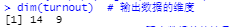

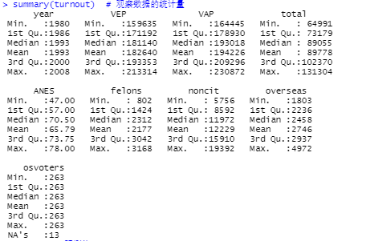

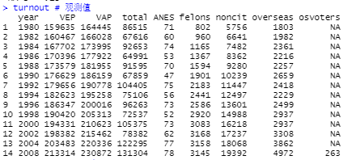

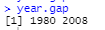

## Q2:VEP和VAP的投票率

### 计算方法

vapPercentage = 投票总人数 / 符合投票年龄的人数

**VAP的符合投票年龄的人数需要加上海外选民的数量。**

vepPercentage = 投票总人数 / 符合投票条件的人数

而后对两个数据值的差值进行平均值、方差、标准差、最小值、最大值等的计算

### 代码实现

\# 计算总符合投票年龄的投票人数

`totalVoters <- turnout$VAP + turnout$overseas`

`vapPercentage <- (turnout$total / totalVoters) * 100`

`vepPercentage <-  (turnout$total / turnout$VEP) * 100`

`difPercentage <-  vapPercentage - vepPercentage`

`summary(difPercentage)`

`sd(difPercentage)`

`var(difPercentage`

### 结果

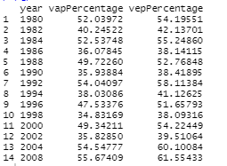

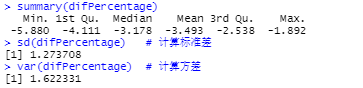

## Q3：VAP、VEP与ANES的差异

### 计算方法

定义一个函数，用于计算两个数据的差

定义一个函数，用于计算数据的平均值、最大值、标准差和方差

调用函数

### 代码实现

`DifPerCalculate <- function(x, y){`

`# 计算两个数据的差和它们的差之间的平均值、范围、方差和极差`

`# Args:`

`#   x: numeric`

`#   y: numeric`

`# Returns:`

`#   返回数据差dif`

`return(x - y)`

`}`

DifPerS`ummaryCal <- function(dif){`

`# 计算两个数据的差的平均值、最大值、最小值、标准差和方差`

`# Args:`

`#   向量vector`

`# Returns:`

`#   返回平均值、最大值、最小值、标准差和方差`

`dif.mean <- mean(dif)`

`dif.max <- max(dif)`

`dif.min <- min(dif)`

`dif.var <- var(dif)`

`dif.sd <- sd(dif)`

`dif.summary <- c(dif.mean, dif.max, dif.min, dif.sd, dif.var)`

`names(dif.summary) <- c("mean", "max","min", "sd", "var")`

`return(dif.summary)`

`}`

计算vap与anes投票率的差异

`difAnesVap <- DifPerCalculate(turnout$ANES, vapPercentage)`

`difAnesVap`

计算差值的平均值、最大值、最小值、标准差和方差

`DifPerSummaryCal(difAnesVap)`

计算vep与anes投票率的差异

`difAnesVep <- DifPerCalculate(turnout$ANES, vepPercentage)`

`difAnesVep`

计算差值的平均值、最大值、最小值、标准差和方差

`DifPerSummaryCal(difAnesVep)`

### 结果

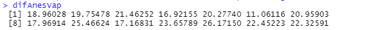

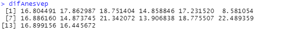

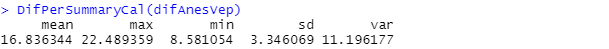

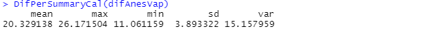

## Q4：ANES在总统大选年和中期选举年与VEP投票率的误差

### 计算方法

通过**等差数列**获取相应的总统大选年和中期选举年的ANES和VEP投票率的数据。

中期选举的年份与总统大选的年份相间隔，1980年是总统大选年，数据缺少2006年的。2006年是中期选举年。

使用Q3定义的函数计算差值以及差值的平均值、最大值、最小值、标准差和方差。

### 代码实现

中期选举年的vepPercentage和ANES数据

`vepPercentageCenter <- vepPercentage[seq(from = 2, to=13, by=2)]`

`anesCenter <- turnout$ANES[seq(from = 2, to=13, by=2)]`

总统大选年的vepPercentage和ANES数据

`vepPercentagePre <- c(vepPercentage[seq(from = 1, to=14, by=2)], vepPercentage[14])`

`anesPre <- c(turnout$ANES[seq(from = 1, to=14, by=2)], turnout$ANES[14])`

计算差值

`difCenterAnesVep <- DifPerCalculate(anesCenter, vepPercentageCenter)`

`difPreAnesVep <- DifPerCalculate(anesPre, vepPercentagePre)`

计算差值的平均值、最大值、最小值、均值、标准差和方差

`DifPerSummaryCal(difCenterAnesVep)`

`DifPerSummaryCal(difPreAnesVep)`

### 结果

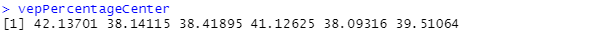

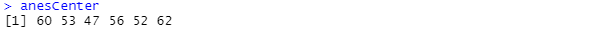

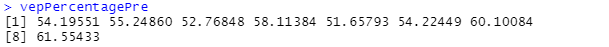

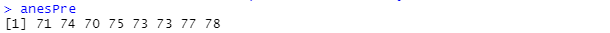

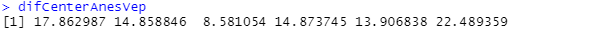

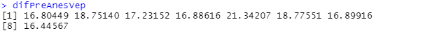

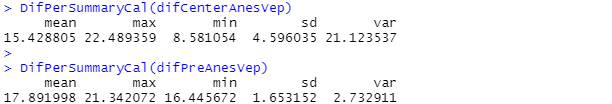

## Q5：ANES在上半段和下半段时间与VEP投票率的误差

### 计算方法

通过**索引**获取相应的上半段和下半段时间的ANES和VEP投票率的数据。

使用Q3定义的函数计算差值以及差值的平均值、最大值、最小值、标准差和方差。

画图表示结果。

### 代码实现

获取上下半段的数据并计算差值

`difAnesVep1 <-  DifPerCalculate(turnout$ANES[1:7], vepPercentage[1:7])`

`difAnesVep2 <-  DifPerCalculate(turnout$ANES[8:14], vepPercentage[8:14])`

计算difAnesVep1和difAnesVep2的平均值、最大值、最小值、标准差和方差

`DifPerSummaryCal(difAnesVep1)`

`DifPerSummaryCal(difAnesVep2)`

画图

`ID<-c(1:7)`

`my_frame<-data.frame(ID, difAnesVep1, difAnesVep2)`

`plot(difAnesVep1~ID,pch=15,col="DarkTurquoise",ylim=c(8,23),ylab="dif")`

`points(ID, difAnesVep1, pch=16, col="DeepPink",cex=1)`

`lines(difAnesVep1, col="DarkTurquoise", lty=1)`

`lines(difAnesVep2, col="DeepPink", lty=2)`

`legend("topleft", c("difAnesVep1", "difAnesVep2"), col=c("DarkTurquoise", "DeepPink"), text.col=c("DarkTurquoise", "DeepPink"), pch=c(15,16),lty=c(1,2))`

### 结果

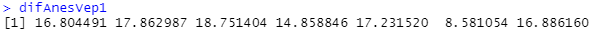

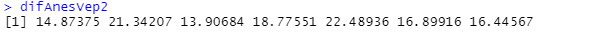

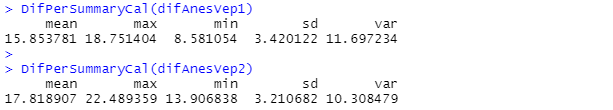

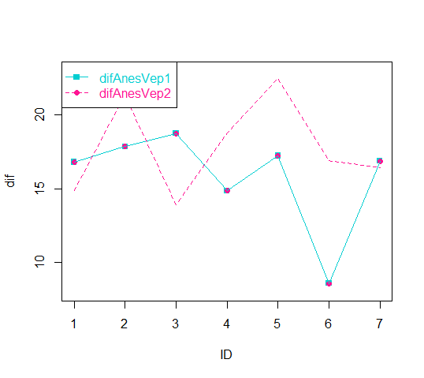

## Q6:2008年vapPercentage的调整结果

### 计算方法

通过减去非公民和犯罪的人数获取调整后的2008年VAP（符合投票年龄）的人数。

通过减去海外选民的投票数获取调整后的投票总人数。

vapPercentage = 调整后的投票总人数 / 调整后的符合投票年龄的人数

通过Q3的函数对调整后的2008年vapPercentage与原来的值、2008年vepPercentage、2008年ANES的值进行差异计算。

### 代码实现

获取VAP2008年调整后的人数

`vap2008New <-  turnout$VAP[14] - turnout$felons[14] - turnout$noncit[14]`

计算VAP2008年调整后的投票率

`vapPercentage2008New <-  ((turnout$total[14] - turnout$osvoters[14])  / vap2008New) * 100`

计算差值

`dif2008 <- data.frame(DifPerCalculate(vapPercentage2008New,vapPercentage2008Old), DifPerCalculate(vapPercentage2008New,vepPercentage2008), DifPerCalculate(vapPercentage2008New,anes2008) )`

`names(dif2008) <- c("NewOld", "NewVep", "NewAnes")`

### 结果

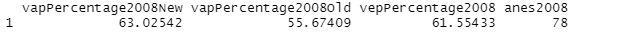

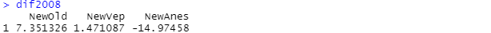
