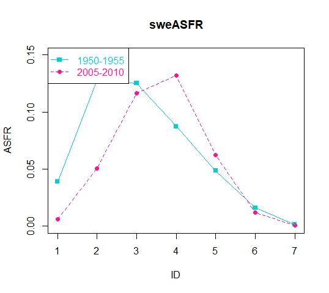

# exercise2

导入数据

`kenya <- read.csv("../Datasets/Kenya.csv")  # 读取肯尼亚的表格数据`

`sweden <-  read.csv("../Datasets/Sweden.csv")  # 读取瑞典的表格数据`

`world <- data.frame(read.csv("../Datasets/World.csv"))  # 读取世界的表格数据`

`summary(kenya)`

`summary(sweden)`

`summary(world)`

## Q1:kenya、sweden与world的CBR 粗出生率

### 计算方法

CBR的计算公式为：

CBR = 出生总人数 / 总寿命数（人-年）

需要定义一个函数用于计算1950-1955年和2005-2010年的CBR。

### 代码实现

定义函数

`CBRCalculate <- function(x){`

`# 计算1950-1955年和2005-2010年的CBR`

`# Args:`

`#   x: data.frame`

`# Returns:`

`#   返回1950-1955年和2005-2010年的CBR数值`

`x1 <- x$py.men[1:15] + x$py.women[1:15]   # 计算1950-1955年的寿命数（人-年）`

`x1CBR <- sum(x$births[1:15]) / sum(x1)   # 计算1950-1955年的粗出生率`

`x2 <- x$py.men[16:30] + x$py.women[16:30]  # 计算2005-2010年的寿命数（人-年`

`x2CBR <- sum(x$births[16:30]) / sum(x2)   # 计算2005-2010年的粗出生率`

`xCBR <- c(x1CBR, x2CBR)`

`return(xCBR)`

`}`

调用函数

`kenCBR <- CBRCalculate(kenya)`

`sweCBR <- CBRCalculate(sweden)`

`worCBR <- CBRCalculate(world)`

### 结果

## Q2:kenya、sweden与world的年龄生育率ASFR

### 计算方法

ASFR的计算公式：

ASFR[x, x+ δ) = [x, x+ δ)年龄段女性人数  /  [x, x+ δ)年龄段女性寿命数（人-年）

定义一个函数用于计算ASFR, 定义一个函数用于画两条数据的折线图。

### 代码实现

定义计算ASFR函数

`ASFRCalculate <- function(x){`

`# 计算ASFR`

`# Args:`

`#   x: data.frame`

`# Returns:`

`#   返回numeric 表示ASFR`

`#`

`return(x$births/ x$py.women)`

`}`

定义画图函数

`PlotDraw <- function(num1, num2, num3, y1, y2, cha1, cha2,cha3, cha4){`

`# 画两条折线图`

`# Args:`

`#   num1: numeric , 表示x轴数据的个数`

`#   num2、num3:y轴取值范围`

`#   y1:vector, y1的取值`

`#   y2:vector, y2的取值`

`#   cha1:character, y1的名称`

`#   cha2:character, y2的名称`

`#   cha3:character, y轴的名称`

`#   cha4:character, 图名称`

`# Returns:`

`#   没有`

`ID <- c(1:num1)`

`my_frame <- data.frame(ID, y1, y2)`

`plot(y1~ID, pch=15, col="DarkTurquoise", ylim=c(num2, num3), ylab=cha3, main = cha4)`

`points(ID, y2, pch=16, col="DeepPink", cex=1)`

`lines(y1, col="DarkTurquoise", lty=1)`

`lines(y2, col="DeepPink", lty=2)`

`legend("topleft", c(cha1, cha2), col=c("DarkTurquoise", "DeepPink"), text.col=c("DarkTurquoise","DeepPink"), pch=c(15,16),lty=c(1,2))`

`}`

函数调用

`kenASFR <- ASFRCalculate(kenya)` \# 肯尼亚的ASFR

`sweASFR <- ASFRCalculate(sweden)` \# 瑞典的ASFR

`worASFR <- ASFRCalculate(world)` \# 世界的ASFR

`PlotDraw(7, 0, 0.4, kenASFR[4:10], kenASFR[19:25], "1950-1955", "2005-2010", "ASFR", "kenASFR" )`

`PlotDraw(7, 0, 0.15, sweASFR[4:10], sweASFR[19:25], "1950-1955", "2005-2010", "ASFR", "sweASFR" )`

`PlotDraw(7, 0, 0.3, worASFR[4:10], worASFR[19:25], "1950-1955", "2005-2010", "ASFR", "worASFR" )`

### 结果

## Q3:kenya、sweden与world的妇女生育平均子女数TFR

### 计算方法

ASFR的计算公式：

TFR = ASFR[15, 20) * 5 + ASFR[20, 25) * 5 + ASFR[25, 30) * 5 + ASFR[30, 35) * 5 + ASFR[35, 40) * 5 + ASFR[40, 45) * 5 + ASFR[40, 45) * 5

定义一个函数用于计算TFR。

计算全世界妇女数量，1950-1955年、2005-2010年全世界总出生人数。

### 代码实现

定义计算TFR的函数

`TFRCalculate <- function(x){`

`# 计算TFR`

`# Args:`

`#   x: data.frame`

`# Returns:`

`#   返回1950-1955年和2005-2010年的TFR数值`

`xTFR <- c(sum(x[4:10] * 5), sum(x[19:25] * 5))`

`return(xTFR)`

`}`

函数调用计算kenya、sweden、world的TFR

`kenTFR <- TFRCalculate(kenASFR)`

`sweTFR <- TFRCalculate(sweASFR`

`worTFR <- TFRCalculate(worASFR)`

全世界女性数量的变化

`worWomenChange = sum(world$py.women[16:30]) - sum(world$py.women[1:15])`

全世界出生总人数

`sum(world$births[1:15])` \# 1950-1955年

`sum(world$births[16:30])` \# 2005-2010年

### 结果

](images/paste-AB0B9E54.png)

## Q4:kenya、sweden与world的粗出生率CDR

### 计算方法

CDR的计算公式为：

CDR = 死亡总人数 / 总寿命数（人-年）

定义一个计算CDR的函数，并调用函数进行计算。

### 代码实现

定义计算CDR的函数

`CDRCalculate <- function(x){`

`# 计算CDR`

`# Args:`

`#   x: data.frame`

`# Returns:`

`#   返回1950-1955年和2005-2010年的CDR数值`

`x1 <- x$py.men[1:15] + x$py.women[1:15]   # 计算1950-1955年的寿命数（人-年）`

`x1CDR <- sum(x$deaths[1:15]) / sum(x1)   # 计算1950-1955年的粗死亡率`

`x2 <- x$py.men[16:30] + x$py.women[16:30]  # 计算2005-2010年的寿命数（人-年`

`x2CDR <- sum(x$deaths[16:30]) / sum(x2)   # 计算2005-2010年的粗死亡率`

`xCDR <- c(x1CDR, x2CDR)`

`return(xCDR)`

`}`

调用函数计算kenya、sweden和world的CDR

`kenCDR <- CDRCalculate(kenya)`

`sweCDR <- CDRCalculate(sweden)`

`worCDR <- CDRCalculate(world)`

### 结果

## Q5:2005-2010年kenya、sweden的各年龄组的死亡率ASDR

### 计算方法

ASDR的计算公式为：

ASDR[x, x+ δ) = [x, x+ δ)年龄段死亡人数  /  [x, x+ δ)年龄段寿命数（人-年）

定义一个函数计算2005-2010年的ASDR。

调用Q2定义的画图函数进行画图。

### 代码实现

定义计算2005-2010年ASDR的函数

`ASDRCalculate <- function(x){`

`# 计算ASDR`

`# Args:`

`#   x: data.frame`

`# Returns:`

`#   返回2005-2010年的ASDR数值`

`x2 <- x$py.men[16:30] + x$py.women[16:30]  # 计算2005-2010年的寿命数（人-年）`

`xASDR <- x$deaths[16:30] / x2   # 计算2005-2010年的ASDR`

`return(xASDR)`

`}`

函数调用计算2005-2010年kenya和sweden的ASDR

`kenASDR <- ASDRCalculate(kenya)`

`sweASDR <- ASDRCalculate(sweden)`

调用画图函数画图

`PlotDraw(15, 0, 0.18, kenASDR, sweASDR, "kenASDR", "sweASDR", "ASDR", "ken-swe-ASDR" )`

### 结果

## Q6:2005-2010年kenya的反事实CDR

### 计算方法

用瑞典的人口分布比例计算肯尼亚的反事实。

[x, x + δ) 年龄段的人口分布比例的计算公式为：

P[x, x+ δ) = [x, x+ δ)年龄段人数  /  总人数

反事实CDR的计算公式为：

CDR = ASDR[0, 5) * P[0, 5) + ASDR[5 , 10) * P[5, 10) + ASDR[10, 15) * P[10, 15) + ASDR[15, 20) * P[15, 20) + ...

定义一个函数计算2005-2010年的人口分布比例。

通过反事实CDR公式计算肯尼亚的反事实。

### 代码实现

定义计算人口分布比例的函数

`PCalculate <- function(x){`

`# 计算2005-2010年的P人口分布比例`

`# Args:`

`#   x: data.frame`

`# Returns:`

`#   返回2005-2010年的P数值`

`P <- (x$py.men[16:30] + x$py.women[16:30]) / sum(x$py.men[16:30] + x$py.women[16:30])`

`return(P)`

`}`

调用函数计算

`sweP <- PCalculate(sweden)`

`kenP <- PCalculate(kenya)`

肯尼亚的反事实CDR

`kenSweCDR  <-  sum(kenASDR * sweP)`

### 结果

