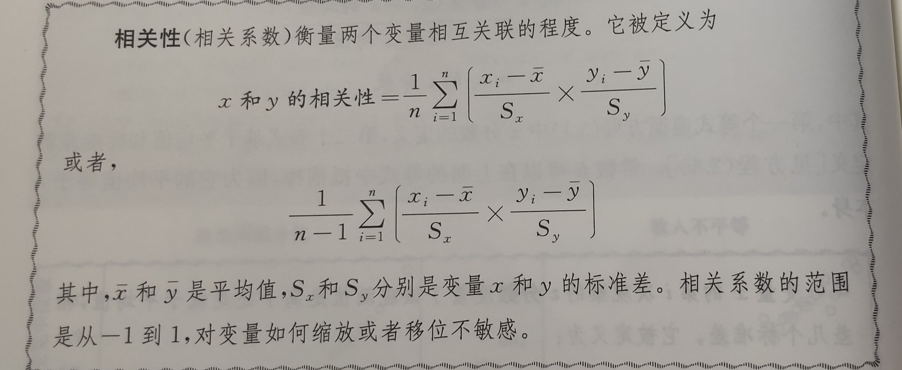

# 3 度量

不是所有被叔叔的事情真的算数，也不是所有算数的事情可以被数数。

------威廉·布鲁斯·卡梅伦《非正式社会学》

## 3.1 战争时期平民的受伤情况的度量

911事件发生后美国及其盟友入侵阿富汗。以北约为名义的国际部队联盟为了发动对塔利班叛军的战争，发动了"民心"运动，将经济援助、服务提供和保护结合起来，以赢得平民的支持。

衡量和理解战争期间的**平民的经历和情绪对评估这场运动的效果**是至关重要的。

一组社会科学家在阿富汗南部进行一次民意调查。该调查于2011年1月至2月期间对2754名受访者进行了调查。

```{r}
## load data
afghan <- read.csv("Datasets/afghan.csv")

## summarize variables of interest
summary(afghan$age)

```

```{r}
summary(afghan$educ.years)
```

```{r}
summary(afghan$employed)
```

```{r}
summary(afghan$income)
```

度量战争对平民伤害的严重程度很难。调查是通过自我报告的方式去度量。

violent.exp.ISAF和violent.exp.taliban变量分别代表受访者是否受到国际安全援助部队和塔利班的伤害。

```{r}
prop.table(table(ISAF = afghan$violent.exp.ISAF, 
                 Taliban = afghan$violent.exp.taliban))
```

过去一年的受访者分别有37.3%和32.8%受到国际安全援助部队和塔利班的伤害。

说明**两方对阿富汗人民都造成了同等程度的伤害。**

## 3.2 处理R中缺失的数据

检查返回值是否为缺失值。

**`is.na()`** 返回逻辑值向量

```{r}
## print income data for first 10 respondents
head(afghan , n = 10)

## indicate whether respondents' income is missing
head(is.na(afghan$income), n = 10)
```

可以直接计算缺失值的数量和比例。

```{r}
sum(is.na(afghan$income))  # count of missing values

## 154

mean(is.na(afghan$income))  # proportion missing
## 0.05591866
```

如果一个变量含有缺失值，**`mean()`函数就会返回NA**。

所以我们可以通过**`na.rm = TRUE`在**计算时将缺失值去掉。

`x <- c(1, 2, 3, NA)`

`mean(x)`

`## NA`

`mean(x, na.rm = TRUE)`

`## 2`

**`table()`**函数也会将NA的值忽略，但是缺失的观测值也是数据集的一部分。我们可以通过附加参数 **`exclude = NULL`** 来包括缺失数据。

上面的式子可以改成：

`prop.table(table(ISAF = afghan$violent.exp.ISAF, Taliban = afghan$violent.exp.taliban), exclude = NULL)`

**`na.omit()`**函数能够直接删除数据框的某个观察值。

但是这是**列表式删除。**简单说就是某人少答一个问题，如果删除变量的缺失值的话，不仅缺失值会被删除，这个人的数据也会被删除。

所以建议抽取去一项数据后再使用，如下：

`afghan.sub <- na.omit(afghan) # listwise deletion`

`nrow(afghan.sub)`

`## 2554`

`length(na.omit(afghan$income))`

`## 2600`

## 3.3 可视化单变量分布

### 3.3.1 条形图

**总结一个变量或者多个变量（多个分类）**。

可以通过`prop.table()`或者`table()`函数生成一个简单的带有计数或者比例的表格。然后通过`barplot()`绘制条形图

参数用法总结：

`main`：绘图主标题

`ylab,xlab` ：横纵坐标的标题

`xlim,ylim`：长度为2的数字向量，指向x轴和y轴的范围。

```{r}
## a vector of propportion to plot
IASF.ptable <- prop.table(
  table(IASF = afghan$violent.exp.ISAF, exclude = NULL))

IASF.ptable

## make bar plot by specifying a certain range for y-axis
barplot(IASF.ptable, 
        names.arg = c("No harm", "Harm", "Nonresponse"),
        main = "CIvilian victimization by the ISAF",
        xlab = "Response category",
        ylab = "Proportion of the respondents",
        ylim = c(0, 0.7))

## repeat the same for victimization by the Taliban
Taliban.ptable <- prop.table(table(Taliban =
      afghan$violent.exp.taliban, exclude = NULL))

barplot(Taliban.ptable, 
        names.arg = c("No harm", "Harm", "Nonresponse"),
        main = "CIvilian victimization by the Tailiban",
        xlab = "Response category",
        ylab = "Proportion of the respondents",
        ylim = c(0, 0.7))
```

图中发现国际援助部队和塔利班造成的平民伤害分布很相似。无回复率也非常相似。

### 3.3.2 直方图

直方图的密度计算公式：

$密度 = 直方图中观测数所占比例 / 直方的宽度$

使用hist()函数并将freq设置为False，freq绘制频率，而不是以密度作为直方图的高度。

```{r}
hist(afghan$age, freq = FALSE, ylim = c(0, 0.04), xlab = ("Age"), main = "Distribution of responder's age")
```

这个也被认为是密度分布直方图，总面积等于1。

接下来我们对区间进行设置，而不是让R自动选择直方的宽度，以便每个整数值为中间值。

每个直方图的高度表示接受相应受教育年数的观测值的比例。`breaks`参数为一个向量设置直方图之间的**断点**。

breaks也接受一个整数来指定直方图的直方形的数目。

`abline()`函数添加中位数垂直线

-   `abline(h = m)` ：做一条y = m的直线

-   `abline(v = m)`：做一条x = m的直线

-   `abline(a = m , b = k)` ：m表示截距，k表示斜率，所以是一条 y = kx + m 的直线

用`lines()`函数绘制

-   `lines(x  = rep(median(afghan$educ.years), 2), y = c(0, 0.5)`

`text()`函数添加文本标签。`text(x , y , z , "character")`

```{r}
## histogram of education. use "breaks" to choose bins
hist(afghan$educ.years, freq = FALSE, 
     breaks = seq(from = -0.5, to = 18.5, by = 1),
     xlab = "year of education",
     main = "Distribution of respendent's education")

## add a text label at(x, y) = (3, 0.5)
text(x = 3, y = 0.5, "median")
## add a vertical line representing median
abline(v = median(afghan$educ.years))
```

### 3.3.3 折线图

lines(x, y )：x和y的值一一对应。

还有一些关于颜色、线条的参数。

-   col：指定颜色。可用于`text()`、`lines()`和`points()`中。键入colors()可以查看R所有内置的颜色名称。

-   lty：指定要绘制的线条的类型，使用字符或者数值。包括"solid"或"1"（默认为实线），"dashed"或"2"代表线条状虚线，"dotted"或"3"代表点状虚线，"dotdash"或"4"代表点和条状混合的虚线，"longdash"或"5"代表长虚线。可用于`abline()`和`line()`。

-   lwd：指定lwd = 1是默认值的行的粗细。用于许多生成行的函数，包括`abline()`和`lines()`

### 3.3.4 箱型图

将中位数、四分位数和IQR作为单个对象进行可视化的一种方式。可以紧凑地比较多个变量的分布情况。

使用`boxplot()`函数。

```{r}
## command for plotting curly braces and text in blue are omitted
boxplot(afghan$age, main = "Distribution of age", ylab = "Age", ylim = c(10, 80))
```

当表示多个分布式，可以使用R中的 `y ~ x` 公式完成。`boxplot( y ~ x, data = d)`。

```{r}
boxplot(educ.years ~ province, data = afghan,
        main = "Education by province", 
        ylab = "Year of education"
          )
```

Helmand和Uruzgan的教育水平远低于其他三个省。

```{r}
tapply(afghan$violent.exp.taliban, afghan$province, mean, na.rm = TRUE)

tapply(afghan$violent.exp.ISAF, afghan$province, mean, na.rm = TRUE)
```

### 3.3.5 打印和保存图标

```{r}
pdf(file = "Output/educ.pdf", height = 5, width = 6) ## 打开PDF并设置图形区域的宽度和高度


boxplot(educ.years ~ province, data = afghan,
        main = "Education by province", 
        ylab = "Year of education"
          )

dev.off() ## 关闭PDF说明绘图结束
```

在同一个文件中将多个图形相邻地打印出来用于比较。

首先要使用**`par(mfrow = c(X, Y))`**函数，创建一个X行Y列的子图。

而后采用**`par(mfcol = c(X,Y))`**函数来**逐列**填充网格。其中还可以设置很多参数。

-   cex：默认值为1，表示字符或符号的大小

-   cex.main：主题标签

-   cex.lab：轴标题标签

-   cex.axis：轴值标签

```{r}
pdf(file = "Output/hist.pdf", height = 4, width = 6)
## one row with 2 plots with font size 0.8
par(mfrow = c(1, 2),cex = 0.8)

## for simplicity omit the text and lines from earlier example
hist(afghan$age, freq = FALSE,
     xlab = "Age", ylim = c(0, 0.04),
     main = "Distribution of respondent's age")

hist(afghan$educ.years, freq = FALSE,
     breaks = seq(from = -0.5, to = 18.5, by = 1),
     xlab = "Years of education", xlim = c(0, 20))

dev.off()
```

## 3.4 调查抽样

### 3.4.1 随机化的作用

-   简单随机抽样（SRS）：选定抽样框，选择样本。

-   确定样本具有**代表性**：对象平均特征是相同的。

-   配额抽样（定比抽样/分层抽样）

因为阿富汗很难获得全民的抽样框架，所以需要在合理的分区内抽样调查对象。

**多阶段整群抽样方法**：首先对较大的单位进行抽样，然后在每个被选取的较大单位内随机选择较小的单位，以此类推进行多个阶段的抽样调查。

**基什网格法（**Kish grid）：？

**自然对数转换**： 为了防止极端数据的影响，我们也会把数据转化成对数。

```{r}
## load village data
afghan.village <- read.csv("Datasets/afghan-village.csv")

## box plot for attitude
boxplot(altitude ~ village.surveyed, data = afghan.village,
        ylab = "Altitude(meters)", names = c("Nonsampled", "Sampled") )
## box plot for log population
boxplot(log(population) ~ village.surveyed, data = afghan.village,
        ylab = "Log population", names = c("Nonsampled", "Sampled") )
```

发现虽然存在一些异常值，但是两个变量的分布在抽样和非抽样的村庄之间基本是相似的。所以似乎样本代表了总体。

### 3.4.2 拒访和其他偏误来源

偏误有可能是受访对象**拒访或拒答**所导致的，即使抽样的理想是具有代表性的，但是实际访谈中也可能出现拒访的情况，甚至在接受访谈时也会出现拒答的情况。

比如塔利班和国际安全援助部队对平民伤害的问题拒访率在各省就有所不同。

```{r}
tapply(is.na(afghan$violent.exp.taliban), afghan$province, mean)
tapply(is.na(afghan$violent.exp.ISAF), afghan$province, mean)
```

发现在Helmand和Uruzgan这些被称为最暴力的省份拒访率是最高的。

另外一种引起误差的因素是错误报告，或者是**社会期许偏误**(social desirability bias)。指受访者更倾向于选择社会认可和期许的答案。

**如何去解决这个问题**：既然这种在战时比较敏感的问题容易给受访者带来麻烦，那可以选择**项目计数技术**或者说列表实验的调查方法。通过加总为调查者提供一定程度的匿名。"你只需要选出你同意或支持以上多少个组织或者个人即可"，控制组的有三个不敏感的对象：卡尔扎伊政府、全国团结计划、当地农民；实验组（测试对外国军队）有四个对象，其中加入了一个敏感对象：卡尔扎伊政府、全国团结计划、当地农民、外国军队。通过计算数据的平均对象差异可以估计支持国家安全援助部队的比例。

地板效应或者天花板效应：如果受访者回答0或4会直接暴露真实的选择。

```{r}
mean(afghan$list.response[afghan$list.group == "ISAF"]) - mean(
  afghan$list.response[afghan$list.group == "control"])

```

```{r}
## 当塔利班加入时，我们可以看到这些地板效应或者天花板效应的明显证据。
table(response = afghan$list.response, group = afghan$list.group)
```

他们并不想被认为明确支持或者批评塔利班。

随机回答技术：六面筛子，如果结果是1，则回答是，如果结果是6，则回答否；如果是2-5，则回答真实的答案。回答的保密性得到完全保护。

## 3.5 度量政治极化

简单的空间投票度量模型将立法者的意识形态与他们的投票联系起来。从两个维度------经济和种族自由主义/保守主义------被研究人员确实为战后国会政治的主要思想特征来刻画立法者的意识形态或者说"理想点"。

当理想点更接近现状而非提案时，更可能反对该提案。

SAT和GRE等标准化考试也是使用类似的模型来衡量学生的能力。

## 3.6 概括双变量关系

### 3.6.1 散点图

`plot()`函数创建散点图。绘制双变量之间的关系。

`plot(x, y)`：x和y分别为横坐标和纵坐标的向量。

`points(x, y, pch, col)：`添加新的散点。

```{r}
congress <- read.csv("Datasets/congress.csv")
## subset the data by party
rep <- subset(congress, subset = (party == "Republican"))
dem <- congress[congress$party == "Democrat", ]
## 80th and 112th Congress
rep80 <- subset(rep, subset = (congress == 80))
dem80 <- subset(dem, subset = (congress == 80))
rep112 <- subset(rep, subset = (congress == 112))
dem112 <- subset(dem, subset = (congress == 112))

## preparing the labels and axis limits to avoid reprtition

xlab <- "Economic liberalism/conservatism"
ylab <- "Racial liberalism/conservatism"
lim <- c(-1.5, 1.5)

## scatter plot for the 80th Congress
plot(dem80$dwnom1,dem80$dwnom2, pch = 16, col = "blue",
     xlim = lim, ylim = lim, xlab = xlab, ylab = ylab,
     main = "80th Congress") 
points(rep80$dwnom1, rep80$dwnom2, pch = 17, col = "red")
text(-0.75, 1, "Democract")
text(1, -1, "Republican")

## scatter plot for the 112th Congress

plot(dem112$dwnom1, dem112$dwnom2, pch = 16, col = "blue",
     xlim = lim, ylim = lim, xlab = xlab, ylab = ylab,
     main = "112th Congress")
points(rep112$dwnom1, rep112$dwnom2, pch = 17, col = "red")

```

第一维度分数分别为每届国会的民主党和共和党计算中位立法者。这些党的中位理想点代表了经济自由主义/保守主义维度每个党派的中心。

```{r}
## party median for each congress
dem.median <- tapply(dem$dwnom1, dem$congress, median)
rep.median <- tapply(rep$dwnom1, rep$congress, median)
```

创建时间序列图来现实每个国会的两党中位数。将type参数设置为"1"，以绘制连接中位数的"线"。

`plot(x, y, col, xlim,  ylim, xlab, ylab)`

`lines( x, y, col)`

散点图用图形的方式比较对于同一组对象度量的两个变量，即将每个对象的一个变量值与另一个变量值进行对比。

```{r}
## Democract
plot(names(dem.median), dem.median, col = "blue",type = "l",
     xlim = c(80, 115), ylim = c(-1, 1), xlab = "Congress", 
     ylab = "DW-MOMINATE score(first dimesion)" )
## add Republican
lines(names(rep.median), rep.median, col = "red")
text(110, -0.6, "Democract\n Party")
text(110, 0.85, "Republican\n Party")

## \n为换行
```

### 3.6.2 相关性

计算党派两极分化与收入不平等的加剧之间的关系。使用**基尼系数**进行观察。

基尼系数是衡量某个社会收入平等与不平等的程度，它从0（每个人拥有相同数量的财富）到1（一个人拥有所有的财富）。

$基尼系数 = 平等线与洛伦兹曲线的面积 / 平等线下面的面积$

```{r}
## Gini coefficient data
gini <- read.csv("Datasets/USGini.csv")
## time-series plot for partisan difference
plot(seq(from = 1947.5, to = 2011.5, by =2),
     rep.median - dem.median, xlab = "Year",
     ylab = "Republican median - \n Democratic median",
     main = "Political polarization")
## time-series plot for Gini coefficient
plot(gini$year, gini$gini, ylim = c(0.35, 0.45), xlab = "Year",
     ylab = "Gini coefficient", main = "Income inequality")
```

在R中可以通过`cor()`函数计算相关性。



```{r}
cor(gini$gini[seq(from = 2, to = nrow(gini), by = 2)],
    rep.median - dem.median)
```

### 3.6.3 分位数------分位数图

```{r}
par(mfrow = c(1, 2),cex = 0.8)
hist(dem112$dwnom2, freq = FALSE, main = "Democract",
     xlim = c(-1.5, 1.5), ylim = c(0,1.75),
     xlab = "Racial liberlism/conservatism dimension")
hist(rep112$dwnom2, freq = FALSE, main = "Republican",
     xlim = c(-1.5, 1.5), ylim = c(0,1.75),
     xlab = "Racial liberlism/conservatism dimension")
```

比较两种分布最直接的方式就是**分位数------分位数图（或Q---Q图）**。分位数------分位数图是基于分位数。

分位数------分位数图有45度线，在45度线之上的点表示在纵轴上绘制的变量在相应的分数位处具有比在横轴上的变量更大的值。低于则相反。

如果这些点形成的线的斜率大于45度，那么纵轴上的点的分布比横轴上点的分布更分散一些；如果斜率小于45度，则纵轴上点的分布没有横轴上的点分散。

```{r}
qqplot(dem112$dwnom2, rep112$dwnom2, xlab = "Democract",
       ylab = "Republicans", xlim = c(-1.5, 1.5), 
       ylim = c(-1.5, 1.5), 
       main = "Racial liberalism/conservatism dimension")
abline(0, 1)
```

## 3.7 聚类

### 3.7.1 R中的矩阵

**数据框 VS 矩阵**

数据框可以采用不同的类型的变量（例如数字、因子、字符等），而矩阵原则上只能使用数值（虽然某些时候也可以采用逻辑和其他特殊值）。

`matrix(data,  nrow, ncol, byrow = FALSE)`

-   data：输入的数据

-   nrow：指定行数

-   ncol：指定列数

-   byrow：TRUE或FALSE,指定按行还是列填充数据

还可以通过`rownames()`和`colnames()`函数向行和列添加标签。

```{r}
## 3X4 matrix filled by row
## first argument takes actual entries
x <- matrix(1:12, nrow = 3, ncol = 4, byrow = TRUE)
rownames(x) <- c("a", "b", "c")
colnames(x) <- c("d", "e", "f","g")
dim(x)

x
```

`as.martix()`会将数据框对象强制转换为矩阵，会将不同类型的变量转换为单一类型的字符。

矩阵一些操作：

-   `rowSums()`：列的总和

-   `colMeans()`：列的平均值

-   `apply()`：三个参数，第一个参数为矩阵；第二个参数为维度：1是行2是列；第三个参数是function

```{r}
## data frame can take different data type
y <- data.frame(y1 = as.factor(c("a", "b","c")), 
                               y2 = c(0.1, 0.2, 0.3))
class(y$y1)
class(y$y2)

z <- as.matrix(y)
z
```

```{r}
## column sums
colSums(x)
apply(x, 2, sum)
## row means
rowMeans(x)
apply(x, 1, mean)
```

### 3.7.2 R中的列表

列表可以存储不同类型的对象、不同长度的数据和字符向量。

-   列表提取：`$` 或者`[[]]`双括号，其中的整数或元素名称提取元素

-   `names()`：提取元素名称

-   `length()`：提取元素数量

```{r}
## create a list
x <- list(y1 = 1:10, y2 = c("hi", "hello", "hey"),
          y3 = data.frame(z1 = 1:3, z2 = c("good", "bad","ugly")))
## three ways of extracting elements from a list
x$y1 # first element

x[[2]] # second element

x[["y3"]] # third element

```

```{r}
names(x)
length(x)
```

### 3.7.3 k-均值算法

k-均值算法是一种迭代算法，重复执行一组操作直到不再产生明显的结果差异。该算法是把数据分成k个相似的主，其中每个组与其质心相关联，这等于组内均值。

首先将每个观察值分配给最近的簇，根据这个新的簇分配计算每个群集的质心来完成的。这两个步骤是迭代的，直到集群分配不再改变。

**k-均值算法**产生预定数量k的聚类，包含下列步骤:

-   步骤1：选择k个聚类的初始质心

-   步骤2：给定质心，将每个观测值分配给最近的质心（一欧几里得距离定义远近）

-   步骤3：选择坐标等于相应变量的簇平均值的每个簇的新质心。

-   步骤4：重复步2和3直到聚类分配不再改变

```{r}
dwnom80 <- cbind(congress$dwnom1[congress$congress == 80],
                 congress$dwnom2[congress$congress == 80])
dwnom112 <- cbind(congress$dwnom1[congress$congress == 112],
                 congress$dwnom2[congress$congress == 112])

## k-means with 2 clusters
k80two.out <- kmeans(dwnom80, centers = 2, nstart = 5)
k112two.out <- kmeans(dwnom112, centers = 2,nstart = 5)

## elements of a list
names(k80two.out)

## final centroids
k80two.out$centers
k112two.out$centers
```

```{r}
## number of observations for each cluster by party
table(party = congress$party[congress$congress == 80], 
      clusters = k80two.out$cluster)

table(party = congress$party[congress$congress == 112], 
      clusters = k112two.out$cluster)
```

```{r}
## k-means with 4 clusters
k80four.out <- kmeans(dwnom80, centers = 4, nstart = 5)
k112four.out <- kmeans(dwnom112, centers = 4, nstart = 5) 

```

```{r}
## plotting the results using the labels and 
## limits defined earlier

plot(dwnom80, col = k80four.out$cluster + 1, xlab = xlab, ylab = ylab,
     xlim = lim, ylim = lim, main = "80th Congress")
##plotting the centeoids
points(k80four.out$centers, pch = 8, cex = 2)

## 112th Congress

plot(dwnom112, col = k112four.out$cluster + 1, xlab = xlab, ylab = ylab,
     xlim = lim, ylim = lim, main = "112th Congress")
##plotting the centeoids
points(k112four.out$centers, pch = 8, cex = 2)

```

## 3.8 总结

## 3.9 练习

-   exercise1 ：改变对待同性恋婚姻的看法

-   exercise2：中国和墨西哥的政治效力

-   exercise3：联合国大会投票表决
